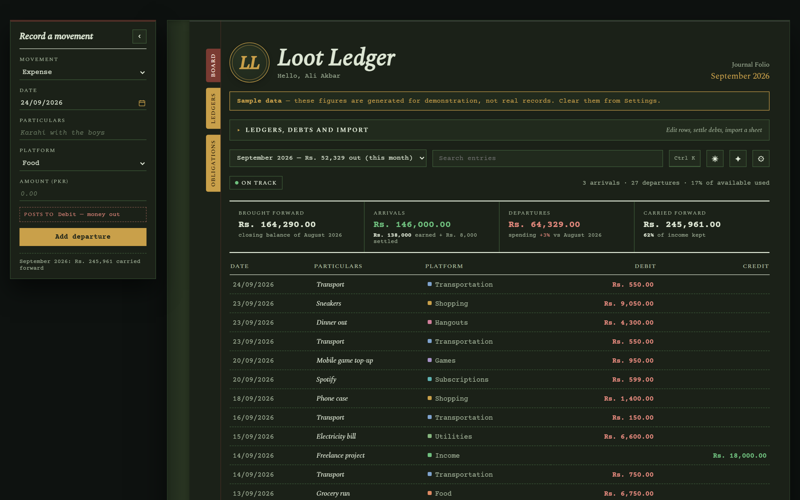
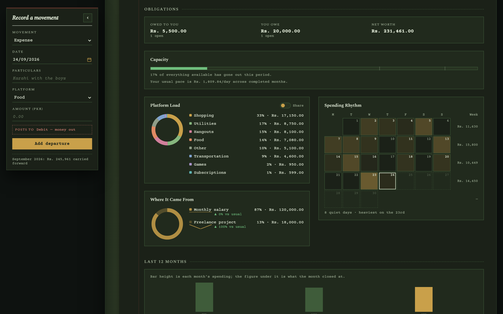
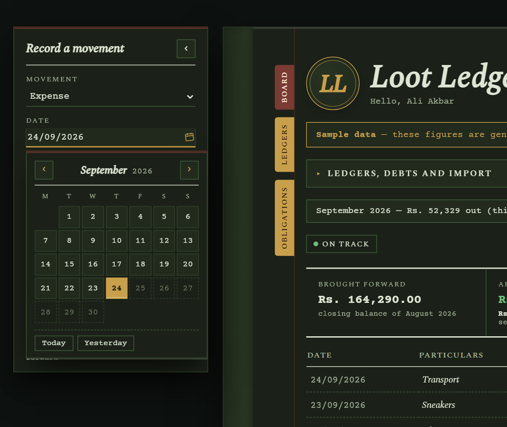
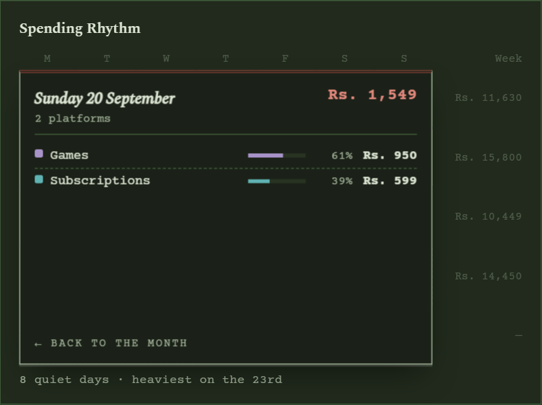
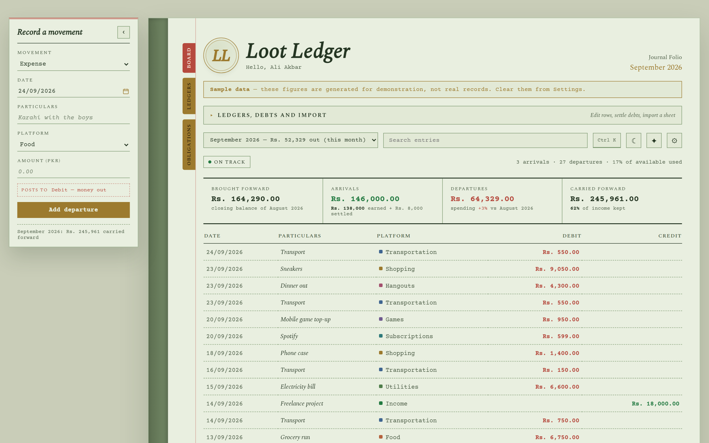
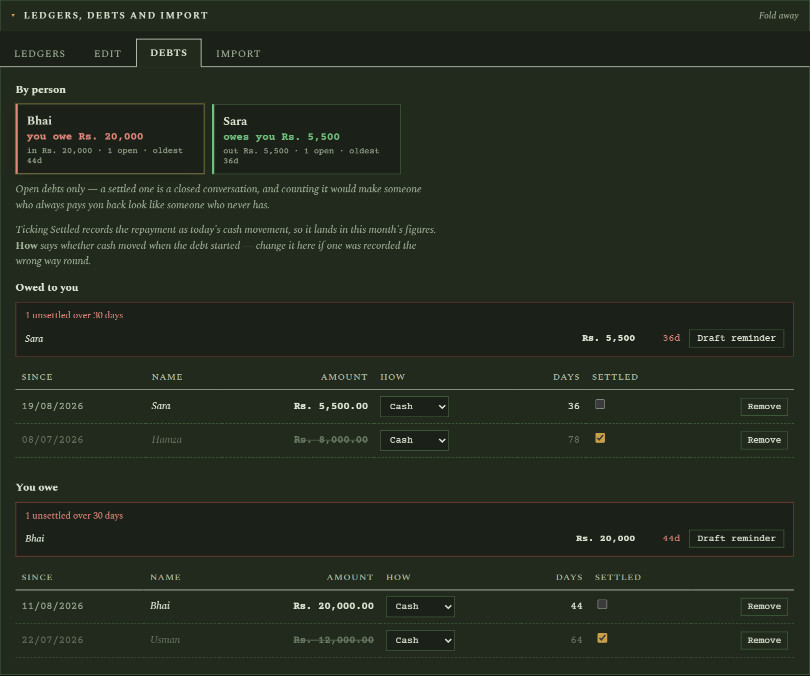
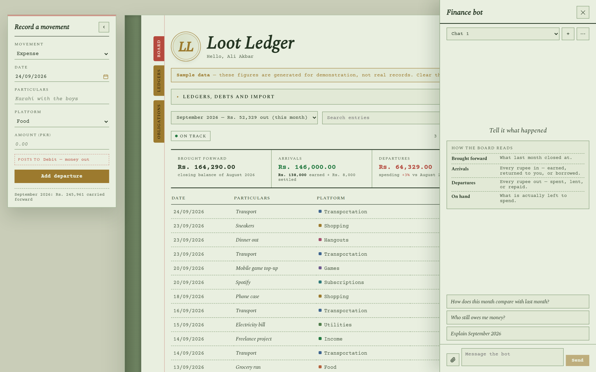
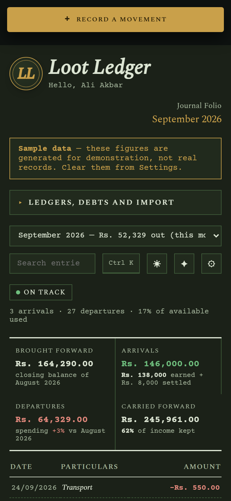

# Loot Ledger

A personal cash tracker kept as a **ledger journal**: every movement of money
written into one ruled double-entry page — debits and credits side by side —
with each month opening on the balance the last one carried forward.

FastAPI + SQLite behind a React + TypeScript page, hand-authored SVG charts,
and a Gemini-backed Finance Bot that can write to the ledgers from a plain
sentence, a spreadsheet, or a photo of a receipt.

Built by [Muhammad Ali Akbar](https://www.linkedin.com/in/muhammad-ali-akbar-khan-7b37b8197).



<sub>Every screenshot is taken with generated sample data — the banner says so
on screen. No real records appear in any of them.</sub>

---

## What's new in v3

Version 3 moves the board off Streamlit onto its own FastAPI + React page and
rebuilds it as the **Ledger Journal**: a book on a desk, a paper page by day
and a lamplit one by night.

- **An entry slip that stays on the desk.** *Record a movement* is docked
  beside the book and stays in view while you scroll, so an entry is written
  with the ledger in front of you. It says which column it will post to before
  you add it, stamps what it entered, and folds away on a hinge into a
  bookmark tab.
- **A date picker drawn in the book's own ink** instead of the browser's
  white one, with Today and Yesterday, and the whole month reachable from the
  keyboard.
- **Panels that open like pages.** The Ledgers, Debts and Import section drops
  open under its bar and folds back up; the entry slip swings on its hinge; the
  Finance Bot slides in and out like a drawer.
- **A log that keeps its place.** The month's ledger scrolls inside its own
  frame with its column heads and ruled-off totals pinned, so a long month never
  pushes the figures around.
- **A day turns over where it stands.** Click a date in Spending Rhythm and that
  one square lifts and flips to show what left the account that day — nothing
  else on the page moves.
- **Book tabs that go somewhere.** Board, Ledgers and Obligations stand against
  the page's red margin rule and take you to their part of the page.
- **Every control answers.** Buttons lift like fresh ink and press in like a wax
  seal; donut slices and their rows light each other; debt cards lift and find
  that person's open rows when clicked; keyboard focus draws one gold ring.
- **A new mark.** The gold italic LL seal before the title, and a matching app
  icon for the browser tab, the home screen and the Windows shortcut.



---

## What it does

**The journal page.** Four figures across the top — brought forward, arrivals,
departures, carried forward — which always balance: brought forward plus
arrivals minus departures is what you carry forward. Under them, the month's
ledger lists every movement with its platform (category), date and amount in a
Debit or Credit column, with totals ruled off at the foot. A status lamp reports
the period as on track, running warm, over budget, or no service. Click any
line to remove it; a repayment line un-settles its debt instead of deleting it.

<p align="center">
  
  
</p>

**Recording a movement.** Expense, income, owed to me, lent out or borrowed,
from the slip docked beside the page. For a loan it asks how it happened — cash
handed over, or something paid on someone's behalf — and says what that does to
your cash before you commit.

**Real carryover.** Months are not islands. Each month opens on the previous
month's closing balance, so a good month visibly funds the next one. An
**opening balance** seeds the first month for savings that predate the board,
without inventing a transaction that never happened.

**Honest debt maths.** Lending is cash leaving now; being repaid is cash coming
back. Borrowing is cash arriving; repaying is cash leaving. A debt can also be
*covered* — someone paid for something on your behalf, so no cash moved when it
started — or simply *owed* to you, like a late salary. A debt opened and
settled inside one month nets to nothing, so by default it is kept out of both
headline totals rather than inflating each by its value — a toggle in Settings
restores both legs. Outstanding obligations are reported separately from
spendable cash.

**Light and dark.** A paper page by day and a lamplit one by night — the same
book, not a different product. The choice is remembered and carried in the URL.



**Five display currencies.** PKR, USD, GBP, EUR and AED, converted on the way to
the screen only. Records stay stored in rupees exactly as entered, so switching
back restores the original figures precisely. Rates refresh once a day and fall
back to the last known set when offline.

**Budgets and pacing.** A monthly cap per category, drawn as a bar under that
category on the Platform Load panel, plus how much of everything available has
gone out and your usual daily pace.

**Trends.** The Platform Load panel switches between *Share* — the donut for the
open month — and *Trend*, a sparkline per category with its total set against
that category's own average over the months before. The graph follows the
period on screen: a month draws its own days, cumulative; All Time draws one
step per month.

**Net worth.** Cash on hand plus what is owed to you, minus what you owe, beside
the two figures it is made of.

**Where it came from.** The mirror of Platform Load: a ring of the month's
income by source, drawn in amber rather than category colours because a
source is whoever paid you, not a category. Each source is set against its own
usual amount once it has a month before this one.

**When it went.** The month as a grid of days, each tinted by what left that
day, with a total per week in the margin. Click a day for what it went on.



**Debts by person.** One card per person with both directions netted, so
someone you have both lent to and borrowed from shows as a single number. Click
a card to find their open rows below. Unsettled debts past 30 days are called
out, with a one-click reminder drafted by the bot.

**It tells you what it has not been told.** An unset opening balance does not
look unset — it looks like you have less money than you do. The page names the
settings that are changing its figures, and each notice clears itself once the
setting is filled.

**Command palette.** Ctrl/Cmd+K to jump to any month, filter the page by
platform, or open Settings and the bot.

**Recurring entries.** Rent, subscriptions and salary are logged from a template
once their day arrives, or skipped for the month.



**The Finance Bot.** Opens from the ✦ button or Ctrl K. Streams its replies and
holds live tool access: `log_expense`, `log_transport`, `log_income`,
`log_lent`, `log_borrowed`, `settle_debt`, plus read tools (`month_summary`,
`list_open_debts`) so it can answer about months that are not on screen. It
cites the figures it used. Conversations are kept as named chats and survive a
restart. The free tier meters requests per model per day, so the bot walks a
chain of models rather than failing when one runs dry. It also writes a short
digest of last month on the first visit of a new one.

**CSV and Excel import.** Drop in a sheet and every block of columns goes to the
ledger it belongs to — spending, income, lent and borrowed all land in one pass.
Or pick one ledger and map the columns by hand. Handles multi-sheet workbooks,
banner rows above the real header, several date formats, currency noise, and
totals rows (which are recognised, not banked).

**Editing.** Any row in any ledger can be corrected in place, in whatever
currency the page is being read in.

**Backup and snapshots.** Every record in every ledger as one flat CSV. A
snapshot of the database is taken automatically before anything that erases
records, and can be restored from Settings.

**Sample data.** Three months of generated records so the page can be seen with
data in it. Labelled with a banner the whole time it is loaded, and one click to
clear. Sample rows are never mixed into real ones.

<p align="center">
  
</p>

**On a phone.** The entry slip folds to a bar above the page and opens downward
like a drawer, the ledger folds its Debit and Credit columns into one signed
amount, and the page installs to the home screen as a standalone app.

---

## Setup

Needs **Python 3.11+** and **Node.js 20+** (Node builds the page; it is not
needed to run it once built).

```bash
pip install -r requirements.txt
```

Add your Gemini API key to `.streamlit/secrets.toml` — the file keeps its old
home so existing installs carry straight over (copy
`.streamlit/secrets.toml.example` to start one):

```toml
GEMINI_API_KEY = "your-key-here"
# optional — any model your key can reach
GEMINI_MODEL = "gemini-3.5-flash-lite"
```

The page works fully without a key. Only the Finance Bot needs one, and it says
so plainly when the key is missing.

### Running it

```bash
python start.py
```

That is the whole thing. It builds the page the first time (and again only when
something under `frontend/` has changed), then serves the API and the page from
one process at `http://localhost:8501` and opens your browser. Ctrl+C stops it.
Data lives in `tracker.db`, created on first run.

On Windows, **`Start Loot Ledger.vbs`** runs the same command with no console
window and opens the browser once the server answers; **`Stop Loot Ledger.bat`**
shuts it down.

Options: `--port`, `--host`, `--no-browser`, and `--rebuild` to force a fresh
build of the page.

Set `LOOT_LEDGER_DB` to point at a different SQLite file — useful for running a
scratch instance beside your real one.

> **Your data never leaves the folder.** `tracker.db`, any spreadsheet you
> import, and `.streamlit/secrets.toml` are all gitignored. Keep it that way:
> the database holds your complete financial history and the secrets file holds
> a live API key.

### Working on it

```bash
python start.py --dev
```

Runs the API with auto-reload on `:8000` and the Vite dev server on
`http://localhost:5173`, which proxies `/api` to it — edits to either side show
up without a restart. The tests run against a throwaway database, never
`tracker.db`:

```bash
pip install -r requirements-dev.txt
python -m pytest
```

### Reaching it from your phone

Reach the machine it already runs on rather than copying your ledger to a
server:

1. Install [Tailscale](https://tailscale.com/) on the laptop and the phone and
   sign both into the same account. The laptop gets a stable private address
   that only your devices can reach.
2. Start the app so it listens beyond localhost:
   ```bash
   python start.py --host 0.0.0.0
   ```
3. Open `http://<tailscale-address>:8501` on the phone. It installs to the home
   screen as a standalone app.

**Put a gate in front of it first.** Once the app is reachable from anywhere it
needs one, even on a private network — set `LOOT_LEDGER_PASSWORD` in
`.streamlit/secrets.toml`. Every API call checks it, so nothing is served to an
unauthenticated visitor — not a figure, not a name. With no password set the app
stays open, which is the right default on a laptop nothing can reach.

The Google sign-in `[auth]` block the Streamlit version supported is not
available in this one. If it is present, the page uses the password when one is
set and otherwise stays locked, saying which setting to add — it never opens
without a gate.

The Streamlit Community Cloud sample board cannot run this version. A public
sample deployment needs a host that runs a Python web server, with
`LOOT_LEDGER_DEMO = "1"` so it seeds and labels generated records.

---

## Layout

| Path | Holds |
|---|---|
| `start.py` | The one command: build the page if needed, serve everything. |
| `api/` | FastAPI app. Thin JSON routes over the modules below, which it calls unchanged. |
| `frontend/` | The React + TypeScript page (Vite). Tokens in `src/styles/tokens.css`. |
| `finance.py` | The money model. Carryover, debt cash movement, formatting. |
| `db.py` | SQLite schema, migrations, queries. |
| `bot.py` | Gemini streaming, tool definitions, system context, model fallback. |
| `importer.py` | CSV and Excel reading, column guessing, row building. |
| `rates.py` | Daily FX rates, cached in `meta`, with an offline fallback. |
| `demo.py` | Labelled sample data. |
| `tests/` | API tests against a throwaway database. |
| `concepts/` | The three design directions the Ledger Journal was chosen from. |
| `static/icon-source.html` | The source of the LL mark; the shipped icons are cut from it. |
| `make_icon.py` | Builds every app icon from one source image, and holds the ICO writer. |
| `PRODUCT.md` | Product truth: users, constraints, principles. |
| `DESIGN.md` | The previous (Departure Board) design system, kept for reference. |

---

## Notes

- Amounts are stored as **integer paisa**, never rupee floats: a REAL column
  drifts over enough fractional arithmetic, an integer one cannot. Conversion
  happens at the storage boundary, so the rest of the app works in rupees. The
  API always returns rupees; the page converts to the display currency.
- Dates are entered and shown as DD/MM/YYYY, stored as ISO.
- Wide screen first, phone supported: on a phone the ledger folds its Debit and
  Credit columns into one signed amount and the Finance Bot opens as a
  full-width drawer.
- Every animation honours the system's reduce-motion setting.
- Transport is both its own ledger and a spending category; the two are summed
  into one "Transportation" platform for charts.
